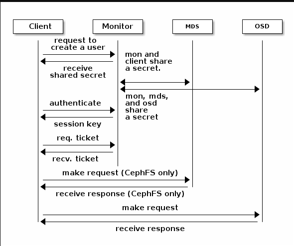

# 认证基础

为了识别用户，防止中间人攻击，`ceph`提供了验证用户和守护进程得 `cephx`身份验证系统

## cephx协议

* 不涉及网络传输中的数据或OSD中存储的数据数据静态加密
* 使用共享密钥进行身份验证，`client`和 `monitor`都有密钥副本

## cephx交互

## 使用场景

1. 命令行与ceph集群操作
   RadosGW对象网关认证
   RBD
2. ceph集群内部组件之间的通信

# 用户基础

# 用户实践

# 密钥管理
